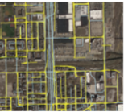
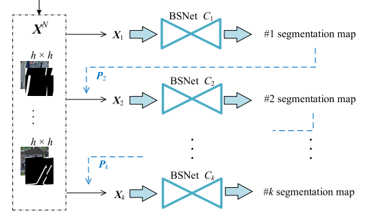
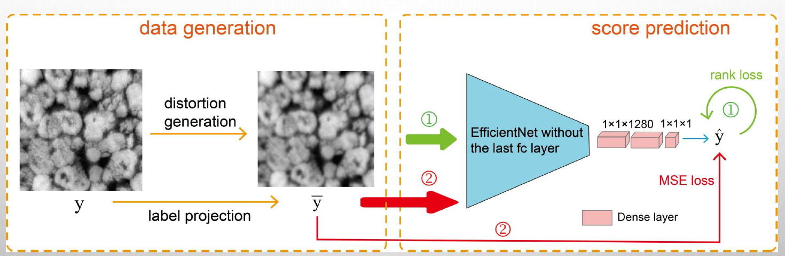

| profile       | description  |
| ------------- |-----|
|  | "[Road Network Extraction from Satellite Images Using CNN Based Segmentation and Tracing]( https://ieeexplore.ieee.org/abstract/document/8898565 )." *IGARSS 2019-2019 IEEE International Geoscience and Remote Sensing Symposium*. IEEE, 2019. Wei, Yao, **Kai Zhang**, and Shunping Ji. [[paper](https://weiyao1996.github.io/files/publications/IGARSS_2019.pdf)] [[poster](https://weiyao1996.github.io/files/publications/Poster_IGARSS_WEI-0802.pdf)] [[code](https://github.com/astro-ck/RoadTracer-M)]|
||"[Simultaneous Road Surface and Centerline Extraction From Large-Scale Remote Sensing Images Using CNN-Based Segmentation and Tracing]( https://ieeexplore.ieee.org/document/9094008 )," in *IEEE Transactions on Geoscience and Remote Sensing*, doi: 10.1109/TGRS.2020.2991733. Wei, Yao, **Kai Zhang**, and Shunping Ji, [[paper](https://weiyao1996.github.io/files/publications/TGRS_2020.pdf)] [[code]](https://github.com/astro-ck/Road-Extraction)|
||"tomography image quality assessment", research internship report.[[paper](files/TomoIQA_report.pdf)] [[slides]](files/TomoIQA_slides.pdf) [[code]](https://github.com/SummerOf15/TomoIQA)|

